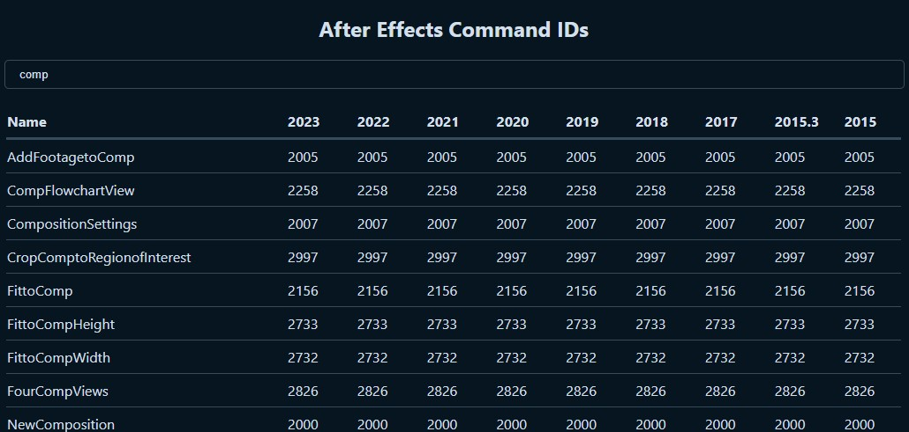

# After Effects Command IDs

Find and use Command IDs for scripting in Adobe After Effects across versions.

_Full blog post:_ https://hyperbrew.co/blog/after-effects-command-ids/

---

## Viewer

Open the viewer to quickly search and find the Command ID for your version of After Effects:

https://hyperbrew.github.io/after-effects-command-ids

---

## Usage

Use Command IDs in After Effects with `app.executeCommand();`

---

## JSON

Download the complete list of JSON file for each version of After Effects in the [`/json/`](./json) folder.

---

## Parser

See the parser in the [`/parser/parse-dat.js`](./parser/parse-dat.js) to find Command IDs yourself.

---

## Develop Quickstart

- Install: `yarn`
- Develop: `yarn dev`
- Build: `yarn build`
